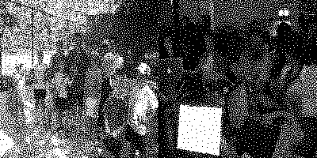

# HVC-VAC
A halftone visual cryptography based on void-and-cluster dithering

## Description




Here we implement the HVC-VAC algorithm proposed in [1]. We also proposed a authentication scheme based on the HVC-VAC algorithm. Check out the notebook for more details.

## How to run

```
python main.py [-h] -f FINGERPRINT -s SIGNATURE -m MESSAGE -o OUTPUT
                  [-sh SHAPE SHAPE] [-r RESAMPLE_RANGE RESAMPLE_RANGE]
                  [-v VERBOSE]
    -f FINGERPRINT, --fingerprint FINGERPRINT
                        fingerprint image path
    -s SIGNATURE, --signature SIGNATURE
                        signature image path
    -m MESSAGE, --message MESSAGE
                        message image path
    -o OUTPUT, --output OUTPUT
                        output images directory
    -sh SHAPE SHAPE, --shape SHAPE SHAPE
                        output image shape
    -r RESAMPLE_RANGE RESAMPLE_RANGE, --resample_range RESAMPLE_RANGE RESAMPLE_RANGE
                        range for resampling shared images
    -v VERBOSE, --verbose VERBOSE
                        verbosity
```


examples
```
# 
sh RUN.sh

# HVC-VAC algorithm
python HVC-VAC.py -f ./HVC-VAC_test/inputs/secret_image.jpg -s ./HVC-VAC_test/inputs/cat.jpg -m ./HVC-VAC_test/inputs/dog -o ./HVC-VAC_test/outputs -sh 200 200 -r 0.20 0.80 -v 1

# Our authentication scheme
python HVC-VAC.py -f ./Authentication_test/inputs/fingerprint.png -s ./Authentication_test/inputs/signature.png -m ./Authentication_test/inputs/messages -o ./Authentication_test/outputs -sh 200 200 -r 0.35 0.65 -v 1
```

## Built With

* Python 3.7.5 :: Anaconda custom (64-bit)

## Authors

* **SaKaTetsu** - *Initial work* - [SaKaTetsu](https://github.com/SaKaTetsu)

## References

[[1]](https://ieeexplore.ieee.org/document/4106475) E. Myodo, S. Sakazawa and Y. Takishima, "Visual Cryptography Based on Void-And-Cluster Halftoning Technique," 2006 International Conference on Image Processing, Atlanta, GA, 2006, pp. 97-100.


[[2]](http://cv.ulichney.com/papers/1993-void-cluster.pdf) Robert A. Ulichney "Void-and-cluster method for dither array generation", Proc. SPIE 1913, Human Vision, Visual Processing, and Digital Display IV, (8 September 1993)
